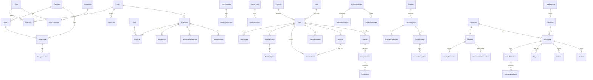

# 實體關聯圖（ERD）

以 Mermaid 表示核心關聯（部分多租戶純量欄位未畫線以維持可讀性）。

```mermaid
erDiagram
  Company ||--o{ Store : has
  Company ||--o{ Warehouse : has
  Store ||--o{ Warehouse : owns
  Warehouse ||--o{ StorageLocation : has

  User ||--o{ UserRole : has
  Role ||--o{ UserRole : grants
  Role ||--o{ RolePermission : has
  Permission ||--o{ RolePermission : in
  User ||--o{ StoreUser : scoped
  User ||--o| Employee : is

  Employee ||--o{ Schedule : assigned
  Employee ||--o{ Attendance : records
  Employee ||--o{ EmployeePreference : prefers
  Employee ||--o{ LeaveRequest : files
  Shift ||--o{ Schedule : used_in

  Category ||--o{ Item : classifies
  Unit ||--o{ Item : base_unit
  Item ||--o{ ItemVariant : variants
  Item ||--o{ ModifierGroup : options
  ModifierGroup ||--o{ ModifierOption : has

  Item ||--o{ StockBalance : balance
  Item ||--o{ StockMovement : ledger
  Item ||--o{ StockLot : lots
  StockLot ||--o{ StockBalance : per_lot
  StockTransfer ||--o{ StockTransferItem : lines
  StockCount ||--o{ StockCountItem : lines

  Supplier ||--o{ PurchaseOrder : supplies
  PurchaseOrder ||--o{ PurchaseOrderItem : lines
  PurchaseOrder ||--o{ GoodsReceipt : received_by
  GoodsReceipt ||--o{ GoodsReceiptItem : lines

  Item ||--o{ Recipe : produced_by
  Recipe ||--o{ RecipeVersion : versions
  RecipeVersion ||--o{ RecipeItem : materials
  ProductionOrder ||--o{ ProductionMaterial : consumes
  ProductionOrder ||--o{ ProductionOutput : yields

  CashRegister ||--o{ CashShift : opens
  CashShift ||--o{ SalesOrder : during
  Customer ||--o| Member : member
  Customer ||--o{ SalesOrder : places
  SalesOrder ||--o{ SalesOrderItem : lines
  SalesOrderItem ||--o{ SalesOrderModifier : modifiers
  SalesOrder ||--o{ Payment : paid_by
  SalesOrder ||--o{ Refund : refunds
  SalesOrder ||--o{ PrintJob : prints

  Member ||--o{ LoyaltyTransaction : points
  Member ||--o{ StoredValueTransaction : stored_value
```
